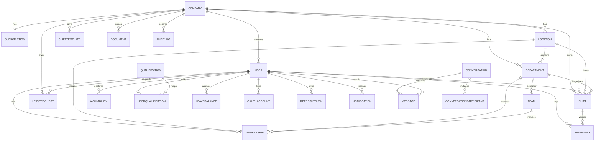

# Fase 3 — Database & ERD

De volledige, gezaghebbende definitie staat in
[`apps/api/prisma/schema.prisma`](../apps/api/prisma/schema.prisma).
Dit document geeft het overzicht en de relaties.

## Entiteitsdiagram (Mermaid)

## Kernrelaties

- **Tenancy**: `Company` is de tenant-root. Alle bedrijfsdata hangt via
  `companyId` aan een bedrijf. Isolatie wordt in elke query afgedwongen
  (tenant-guard in de service-laag).
- **Hiërarchie**: `Company → Location → Department → Team`. Een `User` wordt
  via `Membership` (M:N) gekoppeld aan één of meer locaties/afdelingen/teams.
- **Planning**: `Shift` verwijst naar locatie, afdeling en (optioneel) een
  toegewezen `User`. `ShiftTemplate` bewaart herbruikbare roosters als JSON.
- **Verlof**: `LeaveRequest` (aanvraag + goedkeuring) en `LeaveBalance`
  (saldo per soort per jaar).
- **Uren**: `TimeEntry` koppelt klok-events aan een shift, met afgeleide
  velden voor over-/nacht-/weekenduren.

## Indexen & performance

- Samengestelde indexen op hot paths: `Shift(companyId, startsAt)`,
  `Shift(assigneeId, startsAt)`, `TimeEntry(userId, clockIn)`.
- `slug` en `email` uniek geïndexeerd voor snelle lookups.
- Redis cachet dashboard-aggregaties en bezettingsberekeningen.

## Migraties & back-ups

- Migraties via Prisma Migrate (`npm run db:migrate`).
- Seed met demo-tenant en -accounts (`npm run db:seed`).
- Back-up: `pg_dump` (dagelijks, retentie 30 dagen) — zie `docs/securityplan.md`
  (volgt in latere fase).
